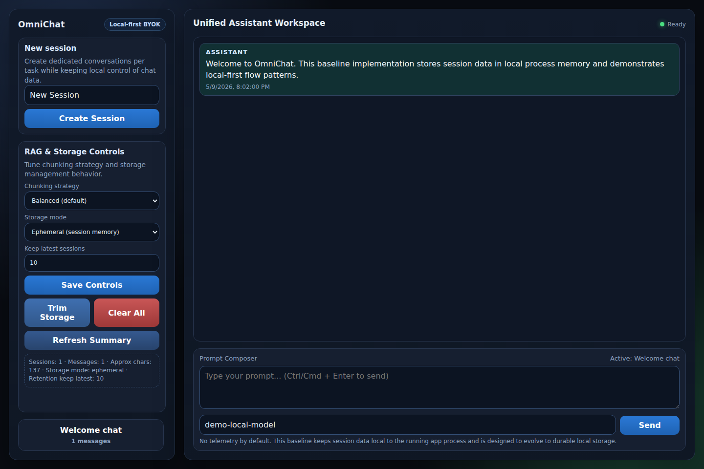
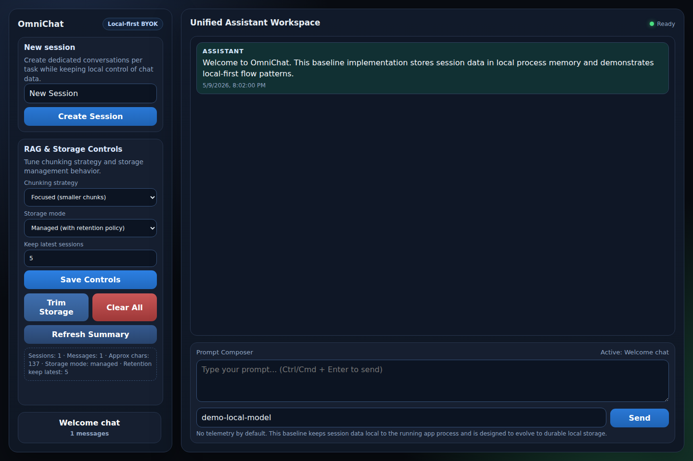
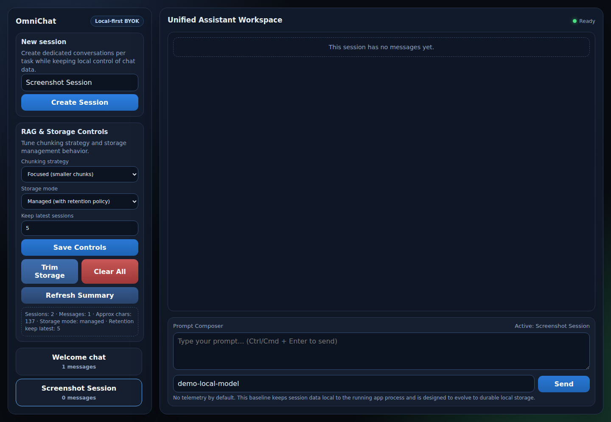
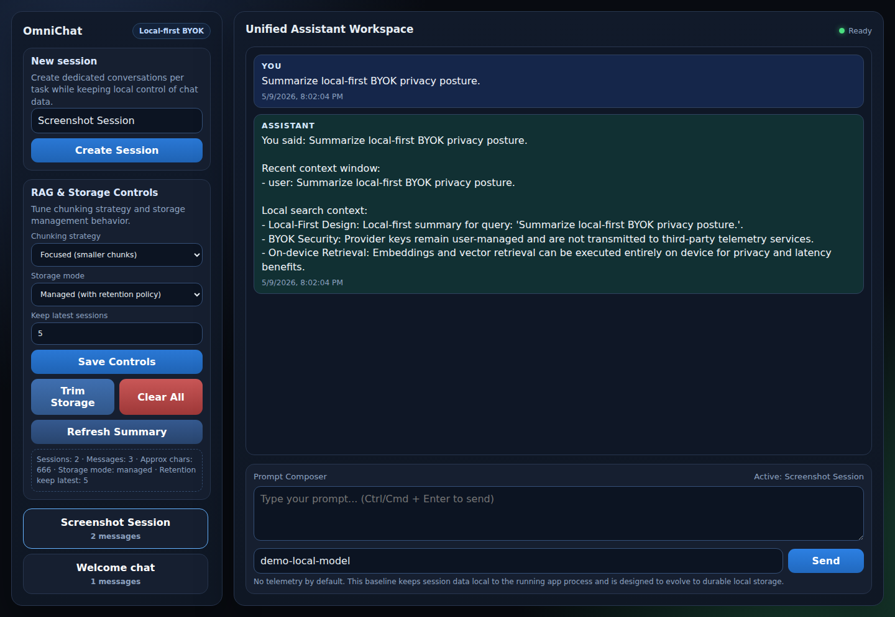

# OmniChat

## Master Product & Architecture Plan (Local-First BYOK AI Client)

### 1) Executive Summary
OmniChat is a premium cross-platform mobile app that provides a unified, privacy-first chat client for LLMs. Users bring their own provider credentials (OpenAI, Anthropic, Azure OpenAI, GCP Vertex AI, AWS Bedrock, Groq, and custom endpoints). Chat history, documents, embeddings, and search execution remain local-first on device, with provider APIs used only when users send prompts.

### 2) Core Product Capabilities
- **Provider-agnostic routing** with per-message model/vendor switching inside the composer.
- **High-polish UI/UX** with smooth transitions, haptics, shimmer/loading states, and native-feeling controls.
- **100% local storage by default** for chats, prompts, imported docs, and vector index.
- **On-device RAG pipeline** for PDF/DOCX/TXT ingestion, chunking, embedding, and retrieval.
- **Local web search agent** powered by user-configured search providers and local HTML extraction.
- **MCP integration** to standardize local tool exposure (search, retrieval, vault access).
- **Conversational experience** with SSE streaming, markdown rendering, syntax highlighting, and branchable histories.

### 3) Users & Personas
- **Privacy Advocate**: Wants strict local data ownership and transparent controls.
- **Power User / Developer**: Needs fast model switching across providers and cost/performance optimization.

### 4) Key User Journeys
#### A. Onboarding & Key Setup
1. Animated intro carousel: *Your Data, Your Device* → *Bring Your Own Key* → *Local Superpowers*.
2. Empty-state chat opens immediately.
3. Inline provider sheet from composer icon for API key or custom endpoint setup.
4. Secure key storage and silent key validation before enabling send.

#### B. Core Chat + MCP Web Search
1. User sends prompt.
2. LLM receives MCP tool schema and may call `local_web_search`.
3. UI shows animated status indicator for active tool execution.
4. Device executes search + scraping locally and appends context.
5. Final answer streams with citations.

#### C. Local Document Ingestion + RAG
1. User selects file attachment.
2. Progress states: extract → chunk → embed → save.
3. Document appears as attached context pill.
4. Query embedding + local vector similarity retrieval performed on device.
5. LLM response cites relevant passages.

#### D. Dynamic Vendor Switching at Prompt Time
1. User taps active model in input bar.
2. Dropdown allows model change or inline provider addition.
3. New provider becomes active without leaving chat context.

#### E. Privacy, Storage & Export
1. Data & Storage dashboard visualizes local usage by category.
2. User can remove selected embeddings/chats.
3. Export all data as JSON via native share sheet.

### 5) Technology Stack
- **App Framework**: .NET MAUI (single C#/XAML codebase, native iOS/Android output)
- **Premium UI Components**: Telerik UI for MAUI or Syncfusion
- **Local relational data**: SQLite (`sqlite-net` or EF Core for SQLite)
- **Local vector retrieval**: `sqlite-vec` (or equivalent local vector store)
- **On-device embeddings**: ONNX Runtime (`Microsoft.ML.OnnxRuntime`)
- **Secure key storage**: `Microsoft.Maui.Storage.SecureStorage`
- **Testing**: xUnit, Moq, Appium, Applitools/Percy

### 6) On-Device RAG Architecture
1. **Parse** imported documents to text.
2. **Chunk** with recursive splitter (~500–1000 tokens, 10–15% overlap).
3. **Embed locally** through ONNX model.
4. **Store** chunk + vector locally.
5. **Retrieve** by cosine similarity and inject top-k context.

### 7) Local Web Search Agent Execution
1. Model decides tool invocation via MCP schema.
2. App executes search through user-selected provider (DuckDuckGo/Tavily/Brave/Google PSE).
3. App fetches links, strips HTML, truncates context, and returns structured evidence.
4. LLM synthesizes and streams answer with source attribution.

### 8) Provider Integration Notes
- **OpenAI / Anthropic / Groq / custom REST**: Bearer-token HTTP.
- **Azure OpenAI**: key + endpoint + deployment name.
- **GCP Vertex AI**: OAuth/service-account JSON, local token signing.
- **AWS Bedrock**: AWSSDK Bedrock runtime with SigV4.

### 9) Security, Performance, and Reliability Requirements
- No telemetry by default and no cloud persistence for local vault data.
- SSE streaming via `HttpCompletionOption.ResponseHeadersRead` for low-latency token rendering.
- Background ingestion/vectorization to avoid UI jank and thermal spikes.
- Local token/context management with summarization fallback for long chats.
- Robust import/export to prevent lock-in and support data recovery.

### 10) QA & Testing Strategy
- **Unit tests**: chunking, token accounting, truncation, SSE parser resilience.
- **Integration tests**: end-to-end RAG pipeline, secure key lifecycle, provider adapters.
- **UI automation + visual regression**: Appium + Applitools/Percy across iOS/Android device matrix and accessibility scales.
- **CI gates**: run unit/integration/UI visual checks on PRs before merge.

### 11) Iterative Delivery Milestones
1. **Core chat foundation + visual identity**
2. **Dynamic provider ecosystem + secure key workflows**
3. **MCP tools + local search agent**
4. **On-device RAG pipeline**
5. **Polish, haptics, and CI hardening**

---

## Repository Status
This repository now includes an initial implementation baseline:

- `src/OmniChat.Core`: core local-first chat, token budgeting, SSE parsing, chunking, lightweight local embedding, and RAG retrieval primitives.
- `src/OmniChat.Web`: lightweight web UI and API surface demonstrating local-first chat/session management plus RAG index/retrieve endpoints.
- `tests/OmniChat.Core.Tests`: automated tests for chunking behavior, token budgeting, SSE parser resilience, and retrieval relevance.

### Run Locally

```bash
dotnet build OmniChat.slnx
dotnet test OmniChat.slnx
dotnet run --project src/OmniChat.Web/OmniChat.Web.csproj
```

### UI Smoke Test Screenshots

Captured UI test screenshots are available at:

- `docs/screenshots/ui-home.png`
- `docs/screenshots/ui-controls.png`
- `docs/screenshots/ui-sessions.png`
- `docs/screenshots/ui-chat-after-send.png`

Preview:






### Reusable Screenshot Automation

Use the reusable screenshot automation script to regenerate the UI gallery:

```bash
python scripts/capture_ui_screenshots.py
```

If you already have the app running, use:

```bash
python scripts/capture_ui_screenshots.py --no-start-server --base-url http://127.0.0.1:5078
```

Playwright setup (one-time per environment):

```bash
python -m pip install playwright
python -m playwright install chromium
```

### Product Owner Readiness Review

A product-owner style readiness review is tracked in:

- `docs/PRODUCT_OWNER_REVIEW.md`

### Chunking & Storage User Options

The web app now exposes runtime controls for:

- **Chunking strategy**: `focused`, `balanced`, `broad`
- **Storage mode**: `ephemeral` or `managed`
- **Retention policy**: keep latest `N` sessions with one-click trim / clear-all actions

Supporting endpoints:

- `GET /api/settings`
- `POST /api/settings`
- `GET /api/storage/summary`
- `POST /api/storage/cleanup`

### Copilot Instructions

Contributor guidance for Copilot and future agent runs is tracked in:

- `.github/copilot-instructions.md`
